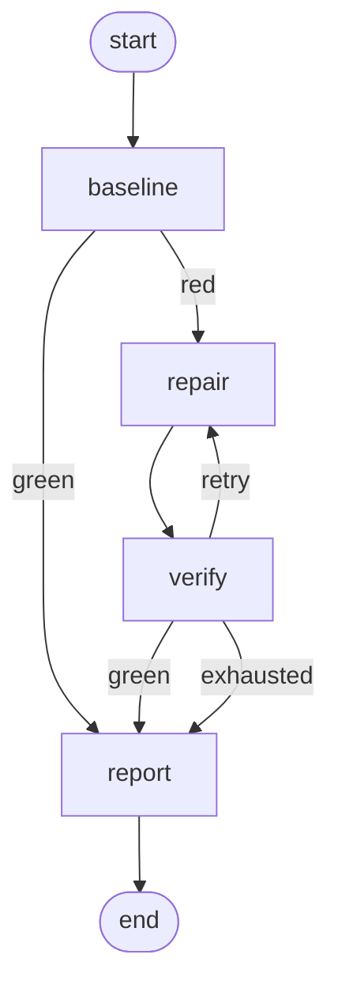

# 3. Graph engineering

> Explicit workflow topology. Fixes: *"the workflow is hard to reason about or
> control."*

The agent's control flow, in full:



`alg graph` prints this from the code, so the diagram cannot drift from the
implementation.

## What moving these decisions out of the prompt buys

Every branch above could have lived inside one long loop with a prompt saying
"check whether the tests pass, and if not, try again, up to three times." Pulling
it into a graph buys four things:

**1. The branch is observable.** `graph.route` events record the label taken at
each decision. A run's whole story is four lines:

```
graph.route  node=baseline  label=red        to=repair
graph.route  node=verify    label=retry      to=repair
graph.route  node=verify    label=exhausted  to=report
```

**2. The branch is testable without a model.** `test_graph.py` asserts routing,
cycle termination, and `max_steps` with plain functions as nodes. Behaviour you
can only test by paying for a model call is behaviour you will not test.

**3. Cycles are bounded twice.** `verify -> repair` is a real cycle, and it has two
independent guards: the router's `max_attempts` check (the intended exit) and the
executor's `max_steps` (the backstop for a router bug). One guard is a bug away
from an infinite loop.

**4. State is a checkpoint.** After every node, `JsonlCheckpointer` writes the
state. A crashed run resumes at the next node instead of re-running the whole
thing, and you can replay a run to the exact state where a decision went wrong.

## Two design rules that carry their weight

**Labels are separate from destinations.** `add_conditional_edge` takes a router
returning a *label* plus a mapping from labels to nodes. Both `green` and
`exhausted` go to `report`, but the trace tells you which happened — the
difference between "solved it" and "gave up", which the node name alone erases.

**State stays JSON-clean.** The workspace, model, and tool registry live on the
`FixerAgent` object, never in graph state. State holds counts, reports, summaries,
and diffs. That is what makes checkpoints small and resumable; `_plain()` in
`graph.py` is a safety net, not the plan.

## The interesting node: `verify`

`verify` does more than run tests. It scores the result (`failed + errors` first,
then `-passed`), compares it to the best state seen so far, and takes one of three
actions:

| Comparison | Action |
| :--- | :--- |
| Green | Snapshot as best; route to `report` |
| Better than best | Snapshot as best; tell the model it made progress |
| Worse than best | **Revert the workspace**; tell the model its change was undone |

That third row is why the graph exists. A loop can retry, but only something
outside the loop can decide the last attempt made things worse and roll it back.
Without it, attempt 3 debugs the damage attempt 2 caused — the failure mode that
makes multi-attempt agents *worse* than single-attempt ones.

The revert is also visible in the trace (`agent.revert`) and in the assessment fed
into the next attempt's prompt, so the model is told what happened rather than
silently finding different code than it left behind.

## Exercises

1. Add a `triage` node before `repair` that classifies the failure (one bug or
   several) and routes to a different prompt per class.
2. Fan out: one `repair` per failing test, in parallel, then a join node that
   merges non-conflicting edits. Note where "shared mutable workspace" breaks.
3. Add a human interrupt: a node that pauses before applying a patch, checkpoints,
   and exits — then resume from the checkpoint after approval. The checkpointer
   already supports this; find what else is missing.
4. Break the router on purpose (return an unmapped label) and confirm `max_steps`
   and the router's own validation both catch it.
